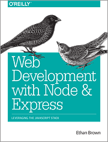

# Overview of CISW 410: Middleware Web Scripting

Websites and the Internet have become an established presence in our lives.
As I'm sure you know, websites come in all shapes and sizes:
social media sites (think _Facebook_, _Twitter_, _Instagram_, ... ),
eCommerce sites (Amazon, Barnes&Noble, ...), and many, many more
(too many to enumerate).
But how does one even go about building an interactive website that provides
useful information and services to its visitors?

In this course, we will learn about _Middleware Web Scripting_ and how
we can use it to build a fully-functional, interactive web application.

Topics will include:

* the scripting language (_JavaScript_)
    * both "client-side" (in the web-browser) and "server-side" (using _NodeJS_)
* the core features of the middleware library module (_Express_)
* server-based databases (_SQLite_)
* how to integrate all these elements together to develop
  a database-driven, interactive web application
* ...and more...

## Course Textbook

The following textbook is required for this course:

* _Title_: **Web Development with Node & Express**
* _Author_: Ethan Brown
* _Pub Date_: 2014
* _Publisher_: O'Reilly Media
* _ISBN_: 978-1-491-94930-6
